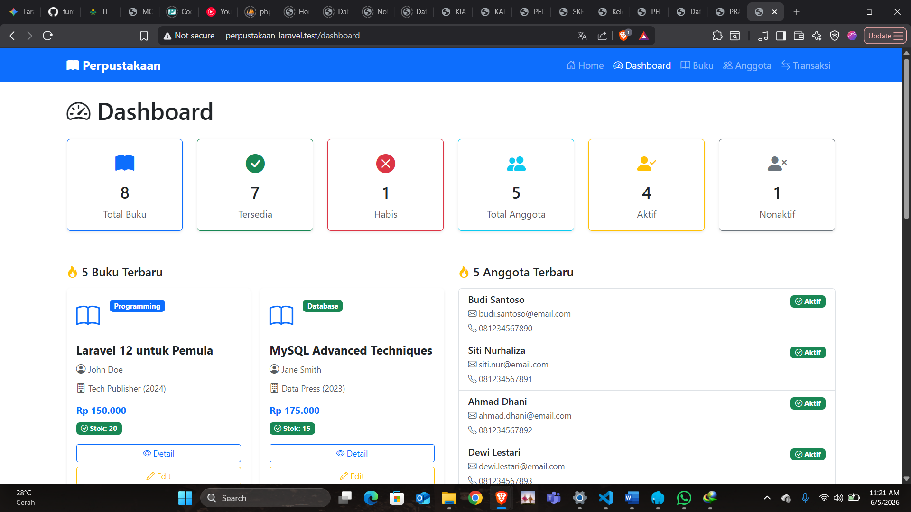
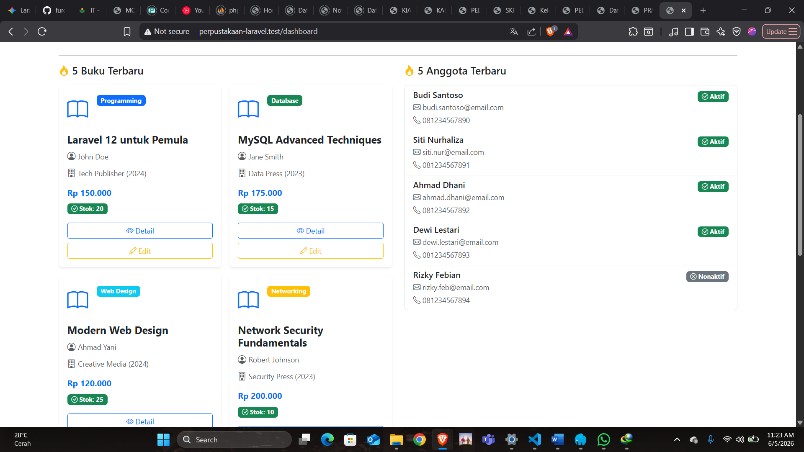
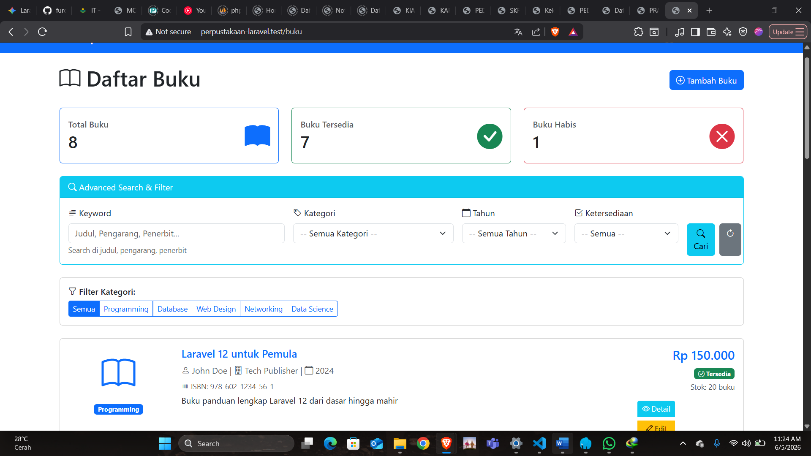
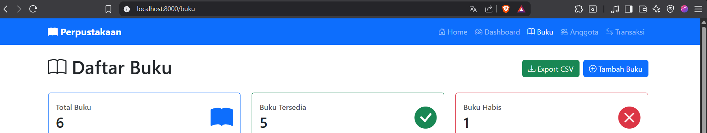
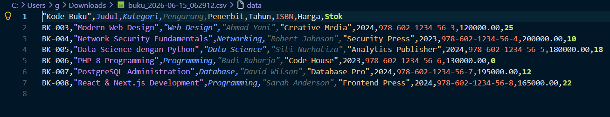

# Tugas 9 Pemrograman Web - Perpustakaan Laravel

Berikut adalah hasil screenshot dari semua route:

### 1. Daftar Anggota (/anggota)

### 2. Detail Anggota (/anggota/1)

### 3. Daftar Kategori (/kategori)

### 4. Detail Kategori (/kategori/1)

### 5. Pencarian Kategori (/kategori/search/programming)

Tugas 10
.png>)
.png>)

Tugas 11

## Tugas Pertemuan 12

### 1. Fitur Advanced Validation

| Validasi Kode Buku                                                     | Validasi Kondisional Kategori & Bahasa                                                     | Validasi Kondisional Tahun & Stok                                                   |
| ---------------------------------------------------------------------- | ------------------------------------------------------------------------------------------ | ----------------------------------------------------------------------------------- |
|  |  |  |

### 2. Fitur Bulk Delete Operations (Hapus Massal)

- **Memilih Beberapa Buku & Tombol Aktif:**
  
- **Konfirmasi SweetAlert:**
  

### 3. Fitur Export ke CSV

- **Tombol Export CSV pada Halaman Utama:**
  
- **Hasil File CSV saat Dibuka:**
  

## Tugas Pertemuan 13

### 1. Auto-Generate Kode Anggota

Field kode anggota terisi otomatis oleh sistem saat form tambah anggota diakses:

### 2. Fitur Export Excel

- **Tombol Export Excel pada Halaman Utama:**
  
- **Hasil Berkas Excel saat Dibuka:**
  

### 3. Fitur Advanced Search & Filter

Proses penyaringan data anggota menggunakan kombinasi beberapa parameter input sekaligus:

